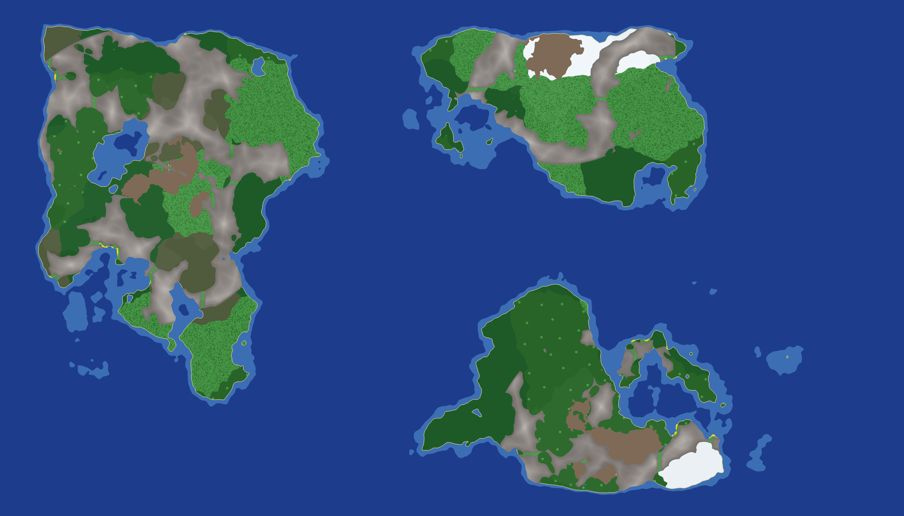

# UOMapPlusPlus

**Multi-library procedural Ultima Online map generator for [ModernUO](https://github.com/modernuo/ModernUO), written in POSIX C.** (binary: `uomappp`)

UOMapPlusPlus is a fork of `uomapgen` that keeps the original POSIX-C / CMake /
FastNoiseLite stack and its **byte-identical determinism contract**, and expands
the single terrain pass set into a **toolbox of generation passes** — each backed
by the algorithm best suited to its job. Everything is implemented in POSIX C
(no Python/Java runtime); passes run in a fixed order inside one binary, and each
can dump a PNG so you can watch the map evolve.

`uomappp` generates classic UO `.mul` map data — terrain (`mapN.mul`), a static
index (`staidxN.mul`), and statics (`staticsN.mul`) — directly from a seed. A
whole world is described by its seed plus a handful of options, and the output is
**byte-identical for a given build and seed**, so maps are perfectly reproducible.
No game assets are modified and no network access is needed; the only optional
input is the client's `tiledata.mul` (read-only).



---

## Generation pipeline

Each row is a pass run in this fixed order by the pipeline harness. The base
terrain + enrichment passes are inherited from `uomapgen`; the **library passes**
are the fork's additions and are **off by default** (enable per the flag), so an
unconfigured run is byte-identical to the original generator.

| # | Pass | Algorithm / library | Flag | On by default |
|--:|------|---------------------|------|:--:|
| 0 | Base terrain (elevation, land/sea, biomes, mountains) | FastNoiseLite (OpenSimplex2) | — | ✅ |
| 1 | **Hydraulic erosion** (valleys, drainage) | droplet erosion + distance transform / blur (SciPy-style, in C) | `--erosion` | ⬜ |
| 2 | **Regions** (organic climate biomes) | **Voronoi** territories (+ boundary noise-warp) + **MST** + marching squares | `--regions` | ⬜ |
| 3 | **Biome transitions** | **Wave Function Collapse** | `--wfc` | ⬜ |
| 4 | **Forest clumps** | **cellular automata** | `--cellular` | ⬜ |
| 5 | **Biome-border dithering** | hashed stipple | `--dither` | ⬜ |
| 6 | Rivers (meander, fords, lakes) | downhill trace | `--rivers` | ⬜ |
| 7 | Beaches (sloped coasts) | BFS distance | — | ✅ |
| 8 | Mountain passes | corridor carve | — | ✅ |
| 9 | Slope limit (navigability) | relaxation | — | ✅ |
| 9b | **Terrace** (Britannia-like flat plateaus) | z quantization | `--terrace` | ⬜ |
| 10 | **Cliff-face mountains** | varied authentic rock tiles + rock statics | `--cliffs` | ⬜ |
| 11 | **Towns, roads, bridges, buildings, trails** | **Poisson-disc** sites + **MST** + **A\*** roads + **BSP** buildings (real stone-wall statics) + **L-system** trails | `--towns` | ⬜ |
| 12 | **Resource nodes** (ore) | **Poisson-disc** | `--resources` | ⬜ |
|  — | Writers + final PNG + install swap | — | — | ✅ |

With `--pass-previews`, every pass writes a descriptively-named snapshot
(`pass00_base_terrain_…png`, `pass11_phase5_towns_…png`, …) into the output
directory so you can inspect each stage, plus a `final` image.

---

## Features

- **Continents** — one central landmass (`--continent`) or an **exact number of
  separate continents** (`--continents --continent-count N`), each a coherent
  terraced, biome-regioned landmass with ocean between. Positions are randomized
  by the seed; `--continent-fill` sets their size (≈0.8 distinct, ≈1.4 merged).
- **Climate biomes** — temperature by latitude + moisture + elevation → snow,
  desert, jungle, swamp, forest, grass, hills. Optionally reshaped into **organic
  Voronoi territories** (`--regions`, with a noise-warp for non-polygonal borders)
  and constrained to **legal transitions** with WFC (`--wfc`).
- **Hydraulic erosion** (`--erosion`) — droplet erosion carves valleys and
  drainage into the relief so rivers follow real watercourses.
- **Rivers** — downhill, meandering, routed around mountains, with **fords** and
  **lakes**. **Mountains** — ridged ranges with walkable **passes**; `--cliffs`
  gives them varied authentic rock tiles and cliff-face rock statics.
  `--mountain-slope N` grades **every** mountain perimeter into sloped foothills
  (a BFS carries the surrounding land height up to N tiles inward) instead of
  leaving vertical walls.
- **Connectivity** (`--connect`) — guarantees no land is cut off by water or
  mountain: a multi-source Dijkstra + MST finds the cheapest links between
  disconnected regions and carves a meandering grass **pass** through mountains or
  a sand **causeway** over inland water. `--pass-width` sets the valley half-width
  (default 10 ≈ 20 tiles wide); `--pass-slope` grades the rock down to the carved
  valley floor (default 8); `--connect-max` caps the crossing cost so the open
  ocean between continents is preserved.
- **Clearings** (`--clearings`) — reserve flat, vegetation-free building plots.
- **Towns** (`--towns`) — Poisson-disc town sites, an **MST + A\*** road network
  that **bridges rivers**, **BSP** building layouts with **real UO stone-wall /
  door statics**, and **L-system** side-trails.
- **Resources** (`--resources`) — Poisson-disc ore nodes on hills / foothills.
- **Vegetation** — deterministic trees, cacti, boulders, reeds, plants per biome,
  written as real statics. **Forest clumping** via cellular automata (`--cellular`).
- **Flat mode** (`--flat`) for building/testing.
- **Deterministic** — same build + seed/config ⇒ identical `.mul` bytes. No RNG,
  no threads, no environment variables; every stochastic pass draws from a
  per-pass splitmix64-derived seed.
- **Configurable** — every option is a CLI flag or a key in an optional INI-style
  config file (CLI overrides the file).

---

## Build

Requires a C11 compiler and CMake. **Build single-core (`-j1`)** — a project
convention:

```sh
cmake -S . -B build
cmake --build build -j1
./build/uomappp --help
```

FastNoiseLite and `stb_image_write` are vendored under `third_party/` (see
`THIRD-PARTY.md`); every other algorithm (erosion, Voronoi, WFC, A\*, BSP,
Poisson-disc, L-systems, cellular automata, MST, marching squares, distance
transforms) is implemented directly in POSIX C. There are no other dependencies.

---

## Quick start

```sh
# A Britannia-like world: the 'britannia' preset is calibrated to the real
# Felucca map0 (~50% water, mostly-flat terraced plains with distinct mountain
# ranges, coherent biome regions) so it looks and plays like Britannia, not noise
./build/uomappp --seed 1337 --preset britannia --out ./out --preview ./out/britannia.png

# Britannia with 3 seed-placed continents, every landmass made reachable
# (--connect carves grass passes through mountains / causeways over water),
# every mountain perimeter graded into sloped foothills (--mountain-slope),
# flat house plots reserved (--clearings), and a reproducible config dumped
./build/uomappp --seed 1337 --preset britannia --continent-count 3 \
    --connect --mountain-slope 24 --clearings \
    --out ./out --preview ./out/world.png --dump-config ./out/world.cfg

# Small test map with a preview image and a ModernUO definition snippet
./build/uomappp --seed 42 --preset test --out ./out \
    --preview ./out/preview.png --emit-mapdef

# The full toolbox: continents, erosion, Voronoi biomes + WFC transitions,
# forest clumps, dithered borders, cliffs, towns, and resources — with a PNG
# dumped after every pass, installed into a UO client/data directory.
./build/uomappp --seed 2024 --preset felucca --continents --mountains --rivers \
    --erosion --regions --wfc --cellular --dither --cliffs --towns --resources \
    --out ./out --pass-previews --install-dir /path/to/uo/data --emit-mapdef

# Flat, buildable version (mountains still elevated)
./build/uomappp --seed 2024 --preset felucca --continents --mountains --flat --out ./out_flat

# Drive everything from a config file (CLI flags still override it)
./build/uomappp --config config/example.cfg --seed 7
```

Run `./build/uomappp --help` for the full, grouped option list (landmass shape,
elevation/mountains, rivers, erosion, regions, WFC/cellular, towns, detail/polish,
connectivity (`--connect`/`--pass-*`/`--mountain-slope`), clearings,
previews/install, and outputs). Keys in the config file mirror the long options
with `-` or `_`; see [`config/example.cfg`](config/example.cfg).

**Reproducing a map:** output is byte-identical for the same **seed + full config
+ build** (a bare seed only reproduces the *default* config). To capture whatever
you tuned on the command line, add `--dump-config world.cfg`: it writes the fully
resolved config (preset + file + flags expanded), and `--config world.cfg` then
regenerates that exact map.

> **Note:** `uomappp` never reads environment variables. All input is CLI flags
> and the optional config file.

---

## Looking like Britannia, not noise

Procedural noise alone produces continuously-varying terrain that reads as
"noise". The real Felucca map is very different, and the differences are
measurable: it is **~50% water**, land elevation is **overwhelmingly flat**
(~63% of land at z=0), and **~81% of adjacent land tiles share the same z** —
large flat plateaus with sharp relief only at rare mountains. The **`terrace`**
pass reproduces that profile by snapping land z into flat terraces, and the
**`britannia` preset** bundles it with calibrated continent / sea-level /
mountain / Voronoi-region values. The result matches the measured Felucca
distribution closely (water ~50%, land z=0 ~60%, land z>20 ~11%, adjacent
|dz|==0 ~85-89%) and reads as a coherent continent with biome regions, mountain
ranges, rivers and polar snow rather than confetti.

## How it works

For each tile the base pass computes an elevation field (fBm noise) plus a
continent falloff to decide land vs. sea, derives a biome from temperature and
moisture, and picks a land tile and Z. The optional library passes then reshape
it — erosion carves drainage, Voronoi territories (noise-warped) + WFC give
organic transition-legal biomes, cellular automata clump forests, rivers/beaches/
passes/slope run, cliffs retexture mountains, and the civilization pass lays down
Poisson town sites joined by MST + A\* roads with BSP buildings (real stone-wall
statics) and L-system trails. Everything is seeded from a single master seed via
`splitmix64` with a frozen, append-only per-pass salt, iterated in a fixed order,
and written little-endian by hand — so output is byte-identical per build.

Town building walls/doors and cliff rocks are emitted as **real statics** and
merged into `staticsN.mul` in canonical per-block order (lengths stay multiples
of 7). See [`docs/FORMAT.md`](docs/FORMAT.md) for the `.mul` byte layout and
[`docs/DETERMINISM.md`](docs/DETERMINISM.md) for the reproducibility contract and
the salt table.

---

## Using the maps

**ModernUO:** copy `mapN.mul`, `staidxN.mul`, `staticsN.mul` into a directory
listed in the server's `dataDirectories` (or use `--install-dir` to copy them
there automatically). The map's `width`/`height` **must match** the entry in
`Data/map-definitions.json` — use `--emit-mapdef` to get a matching snippet, or
`--preset felucca` for a drop-in `map0`.

**Viewing without a server:** render a `--preview` PNG, or point **UOFiddler** at
a UO client directory containing the generated triplet (plus the client's
`tiledata.mul`, `radarcol.mul`, `hues.mul`, art) and open the Map tab. Back up the
client's original `map0/staidx0/statics0` first if you overwrite them.

---

## Project layout

```
CMakeLists.txt          build (always -j1)
include/uomappp/*.h     module headers
src/*.c                 pipeline, config, noise, field, erosion, biome, terrain,
                        voronoi, marching, mst, wfc, cellular, poisson, astar,
                        bsp, lsystem, vegetation, mapwriter, statics, preview,
                        mapdef, install, io, main
third_party/            vendored FastNoiseLite + stb_image_write
config/example.cfg      annotated sample config
docs/FORMAT.md          .mul byte layout
docs/DETERMINISM.md     reproducibility rules + per-pass salt table
```

---

## License

The UOMapPlusPlus source is provided as-is. Vendored third-party components keep
their own licenses (FastNoiseLite: MIT; stb_image_write: public domain / MIT) —
see [`THIRD-PARTY.md`](THIRD-PARTY.md). Ultima Online and its data files are the
property of their respective owners and are not included in this repository.
